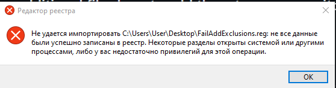
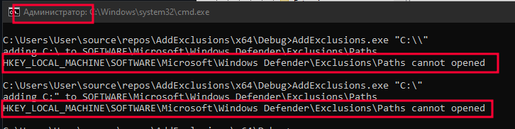

# WinDefInfo
## Information about Windows Defender, Exclusions/Regedit...


### Add path/executable file via PowerShell
#### Run as administrative user
```ps1
Add-MpPreference -ExclusionPath "$Env:AppData\Roaming" # path
Add-MpPreference -ExclusionPath "$env:USERPROFILE\Documents\attacker.exe" # executable
```
#### Can check in Defender


#### Can check in Regedit


### Add path/executable file via Regedit
```ps1
# Path in regedit
# HKEY_LOCAL_MACHINE\SOFTWARE\Microsoft\Windows Defender\Exclusions\Paths

# to add a file/path to exceptions, specify the path to the file/directory in the value name
# type DWORD and value 0
```


### Fail via .reg file
```reg
Windows Registry Editor Version 5.00

[HKEY_LOCAL_MACHINE\SOFTWARE\Microsoft\Windows Defender\Exclusions\Paths]
"C:\\"=dword:00000000
```



### Fail in native application
```c
// all source in FailAdd.c file

#define Exclusions TEXT("SOFTWARE\\Microsoft\\Windows Defender\\Exclusions\\Paths")

HKEY key = NULL;
LSTATUS res = RegOpenKeyEx(HKEY_LOCAL_MACHINE, Exclusions, 0, KEY_SET_VALUE, &key);

if (res == ERROR_SUCCESS) {
    RegSetValueEx(key, argv[1], 0, REG_DWORD, nullptr, 0);
}
```



### Links
https://learn.microsoft.com/en-us/powershell/module/defender/add-mppreference

https://learn.microsoft.com/en-us/powershell/module/defender/remove-mppreference

https://www.elevenforum.com/t/add-or-remove-exclusions-for-microsoft-defender-antivirus-in-windows-11.8797/
