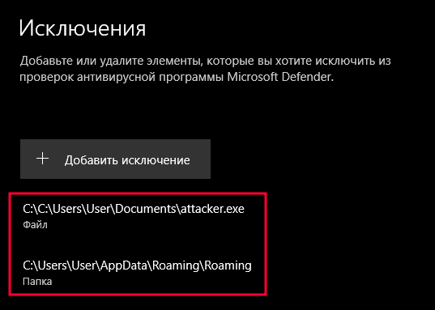
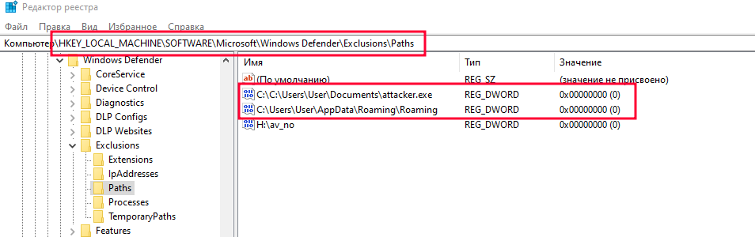

# WinDefInfo
## Information about Windows Defender, Exclusions/Regedit...


### Add path/executable file via PowerShell
#### Run as administrative user
```ps1
Add-MpPreference -ExclusionPath "$Env:AppData\Roaming" # path
Add-MpPreference -ExclusionPath "C:\$env:USERPROFILE\Documents\attacker.exe" # executable
```
#### Can check in Defender


#### Can check in Regedit


### Add path/executable file via Regedit
```ps1
# Path in regedit
# HKEY_LOCAL_MACHINE\SOFTWARE\Microsoft\Windows Defender\Exclusions\Paths

# to add a file/path to exceptions, specify the path to the file/directory in the value name
# type DWORD and value 0


```


```c
int main(void)
{
    return 0;
}
```
